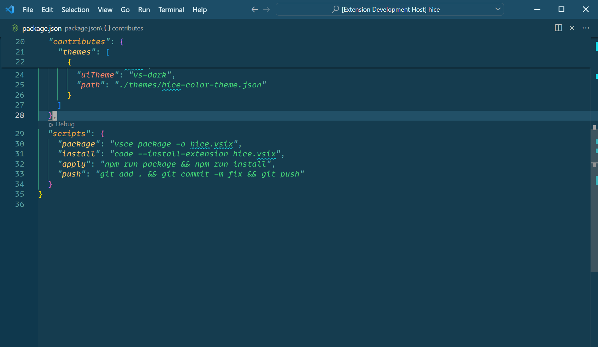
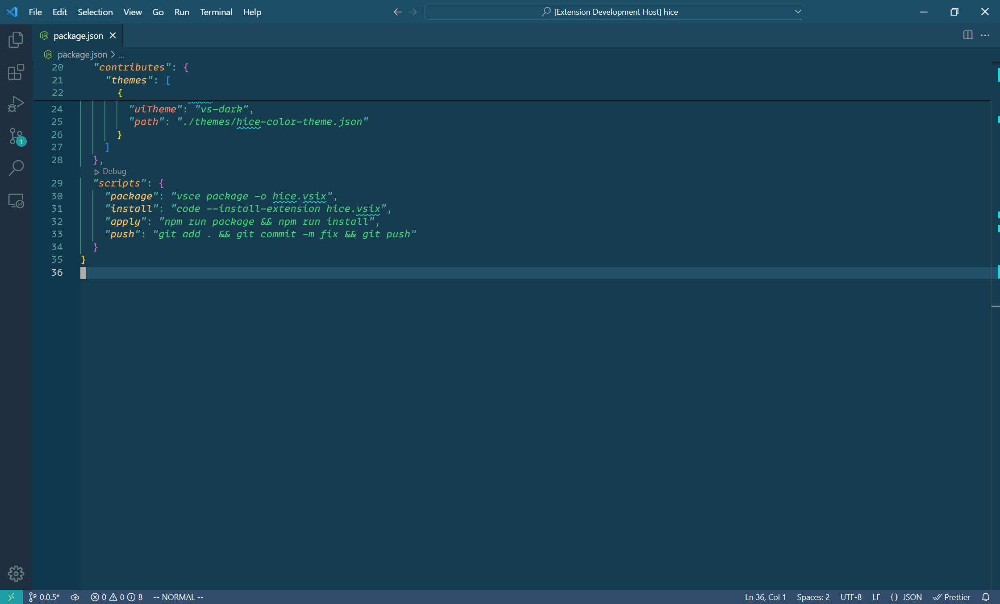

# here README

here 插件是一个用来快速切换 vscode 编辑器状态的插件。

通过设置"here.switchConfigurations"数组，here插件可以循环该数组的元素，在工作区层面设置"here.switchConfigurations.settings",并执行"here.switchConfigurations.commands"中的命令。

"here.switchConfigurations"的默认配置如下：
```json
{
  "here.switchConfigurations": [
    {
      "here.switchConfigurations.settings": {
        "workbench.activityBar.visible": false,
        "workbench.statusBar.visible": false,
        "workbench.editor.showTabs": false
      },
      "here.switchConfigurations.commands": [
        "workbench.action.closeSidebar",
        "workbench.action.closePanel"
      ]
    },
    {
      "here.switchConfigurations.settings": {
        "workbench.activityBar.visible": true,
        "workbench.statusBar.visible": true,
        "workbench.editor.showTabs": true
      }
    }
  ]
}
```
可以看到在执行here:switch(快捷键： ctrl+alt+h)前后的变化：
初始状态

第一次执行

再次执行

