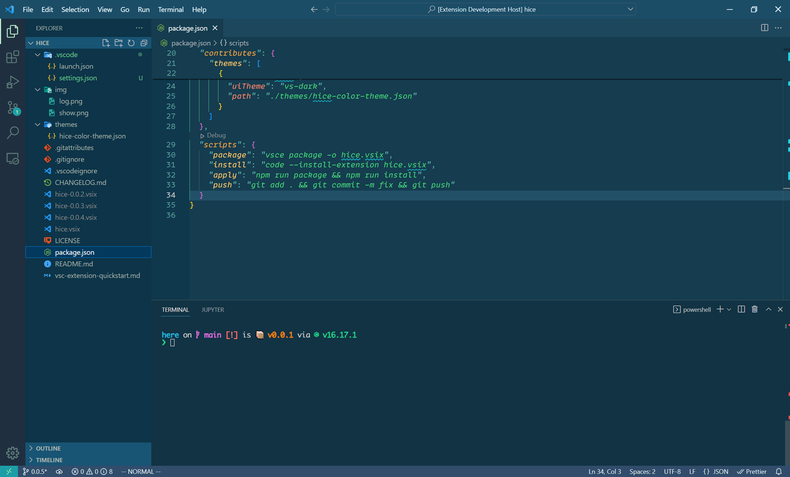

# here README

here is a vscode extension to switch vscode status smoothly.

through setting "here.switchConfigurations" arr，here extension will set "here.switchConfigurations.settings" and run "here.switchConfigurations.commands" to switch vscode status.

it also support async set and run to make this switch faster.

"here.switchConfigurations" settings for example:
```json
{
  "here.switchConfigurations": [
    {
      "here.switchConfigurations.settings": {
        "workbench.activityBar.visible": false,
        "workbench.statusBar.visible": false,
        "workbench.editor.showTabs": false
      },
      "here.switchConfigurations.commands": [
        "workbench.action.closeSidebar",
        "workbench.action.closePanel"
      ]
    },
    {
      "here.switchConfigurations.settings": {
        "workbench.activityBar.visible": true,
        "workbench.statusBar.visible": true,
        "workbench.editor.showTabs": true
      }
    }
  ]
}
```
here:switch(key shortcut: ctrl+shift+t):
before run

first run

second run

